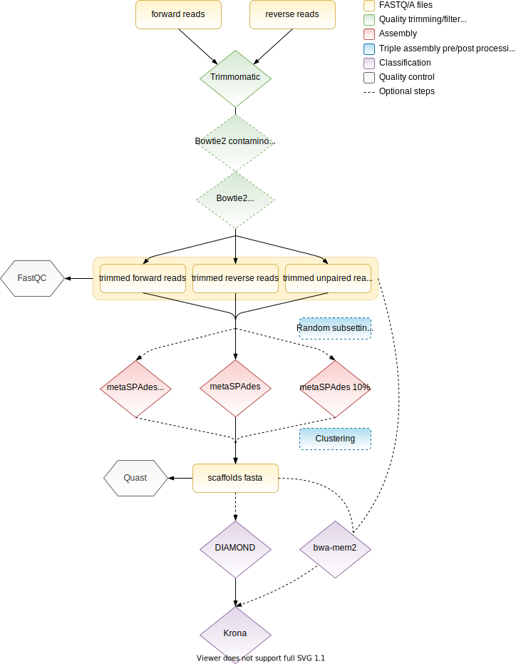

<a href="https://rega.kuleuven.be/cev/viralmetagenomics" target="_blank"></a>

# ViPER - Virome Paired-End Reads pipeline
[](https://github.com/Matthijnssenslab)
[](https://zenodo.org/badge/latestdoi/386618416)
[](https://twitter.com/JMatthijnssens)
[](https://www.facebook.com/MatthijnssensLab)

The ViPER (Virome Paired-End Reads pipeline) script is used by the Laboratory of Viral Metagenomics to process raw paired-end Illumina reads resulting from the [NetoVIR](https://doi.org/10.1038/srep16532) protocol. The NetoVIR protocol is a reproducible, modular approach to enrich multiple sample types (eg. human, insects, plants, etc.) for viruses which can then be sequenced.

In this bioinformatics pipeline, reads are first trimmed by [Trimmomatic](https://github.com/usadellab/Trimmomatic). Subsequently, reads originating from the contaminome (sequenced and assembled negative controls) and the host genome can be removed by [Bowtie2](https://github.com/BenLangmead/bowtie2) and [samtools](http://www.htslib.org/). Left-over reads are further assembled into contigs by [metaSPAdes](https://github.com/ablab/spades).

Final contigs can than be classified by [DIAMOND](https://github.com/bbuchfink/diamond) and [KronaTools](https://github.com/marbl/Krona/tree/master/KronaTools) with a lowest common ancestor approach. This is possible right after assembly with the `viper.sh` script, but is not required. Contigs can still be classified later on by the `viper-classify.sh` script. In addition, reads are mapped to the contigs with [bwa-mem2](https://github.com/bwa-mem2/bwa-mem2) to generate abundances for the Krona chart.

**Disclaimer:**</br>
These scripts are made publicly available in an effort to standardize viromics and the way how virome samples are bioinformatically processed. Although you may freely use the scripts in this repo for your own analysis, support is not guaranteed.

- [Setup](#Setup)
- [Usage](#Usage)
    - [Quick start](#Quick-start)
    - [Command line options](#Command-line-options)
        - [Triple assembly](#Triple-assembly)
- [Output](#Output)
    - [Reads](#READ)
    - [Assembly](#ASSEMBLY)
    - [Contigs](#CONTIGS)
    - [Diamond](#DIAMOND)
    - [Krona](#KRONA)
    - [Quality control](#QC)
- [HPC](#HPC)

## Overview
<p align="center">
    <picture>
      <source media="(prefers-color-scheme: dark)" srcset="img/ViPER_dark.svg">
      
    </picture>
</p>

# Setup
All dependencies for this script can be installed through `conda` (To install `conda`, see installation guide [Miniconda](https://conda.io/projects/conda/en/latest/user-guide/install/index.html)). A list of dependencies (and their respective versions) can be found in the viper.yml file, if you wish to install them independently from `conda`. Otherwise, you can run following commands to install a new conda environment with all necessary dependencies and the ViPER scripts (recommended).

Take into account that, if you have no Krona databases already present, you will also have to install them (>70GB), more info [here](https://github.com/marbl/Krona/wiki/Installing).
```bash
git clone https://github.com/Matthijnssenslab/ViPER.git
cd ViPER
conda env create -f viper.yml
conda activate viper
pip install .

#Install ViPER scripts in `bin` of the new conda environment:
cd bin
ln -sfr * $CONDA_PREFIX/bin

#Symlink Krona databases to conda environment:
rm -rf $CONDA_PREFIX/opt/krona/taxonomy
ln -sf /path/to/Krona/database/ $CONDA_PREFIX/opt/krona/taxonomy
```

# Usage
## Quick start
The most simple use of `viper.sh` is to just give it your forward and reverse reads, both these input files are required. The script will subsequently quality trim these reads with default parameters and assemble quality trimmed reads into contigs using metaSPAdes, also with default parameters. Taxonomic annotation and classififcation by DIAMOND and KronaTools is omitted but can later on be completed with `viper-classify.sh`.
```code
viper.sh -1 read1.fastq(.gz) -2 read2.fastq(.gz)
```

## Command line options
### Reads
`-1 | --read1`
	Path to the file with forward reads, may be gzipped.
	
`-2 | --read2`
	Path to the file with reverse reads, may be gzipped.

`-u | --unpaired`
	File of unpaired reads if trimming was already performed beforehand (see --skip-trimming).

### Trimming
`-x | --crop`
    Crops reads with Trimmomatic CROP to this final length. First 19 bases of each read are removed by default with HEADCROP. (default:'')

`-p | --primer-file`
    Path to the primer file in fasta format with sequences that have to be trimmed by Trimmomatic, or a built-in option by Trimmomatic. (default: `$CONDA_PREFIX/share/trimmomatic/adapters/NexteraPE-PE.fa`)
    
`--skip-trimming`
	Continue with given reads and do not trim the reads for quality and adapters with Trimmomatic. Useful when you already have trimmed your reads beforehand with other software for example.

### Contamination removal
Optionally, the contaminome (reads mapping to sequenced negtve controls) and/or reads mapping to your host genome can be removed. Both these options require a bowtie2 index. 

`-c | --contaminome`
    Path to a bowtie2 indexed contaminome.<br>
    
Sequenced reads from the negative controls can be assembled into contigs by the `viper.sh` script: 
```bash
viper.sh -1 NC.R1.fastq.gz -2 NC.R2.fastq.gz -p /path/to/primer/file -m 200 -o contaminome
```
The resulting contigs have to be indexed by Bowtie2 and can subsequently be used as a contaminome. Note: When multiple negative controls are sequenced, you can concatenate all assembled contigs from the different negative controls into one fasta file.
    
`-g | --host-genome`
    If specified, reads mapping to the given host genome will be removed. Requires the path to a bowtie2 indexed host genome.
    
### Assembly
`-m | --min-length`
    The minimum length for final assembled contigs. (default: 500)

`-k | --spades-k-mer`
    List of k-mer sizes for SPAdes (must be odd and less than 128). (default: 21,33,55,77)

`--triple-assembly`
    Will perform three *de novo* assemblies with metaspades on the full reads, a 10% and 1% subset of the reads. All assembled contigs will be concatenated and clustered together to remove redundancy (see also `--cluster-cover/identity`).

`--memory-limit`
    Memory (in GB) to be reserved for SPAdes assembly. (default: 250)

`--only-assembler`
    Runs only the assembler of metaspades, useful when the error correction gets stuck. (Caution: assembly without error correction does not yield the same results as normal assembly)
    
#### Triple assembly
To overcome the problem of viral genomes breaking into multiple pieces during assembly due to huge coverage (which makes the resulting De Bruijn graph too difficult to interpret by the assembler), a subset of 10% and 1% of the original reads may be applied by `--triple-assembly`. These subsetted reads are also assembled by metaSPAdes and resulting contigs of all three assemblies (from original reads, 10% and 1% subset) are subsequently clustered together to remove redundancy in the contig set. This way shorter contigs belonging to the same genome, but from a different assembly, will be removed and only the most complete contigs will be retained. Clustering is performed by a combination of [BLAST+](https://www.ncbi.nlm.nih.gov/books/NBK279690/), `anicalc.py` and `aniclust.py` which are distributed as part of the [CheckV](https://bitbucket.org/berkeleylab/checkv/src/master/) package.
```code
viper.sh -1 read1.fastq(.gz) -2 read2.fastq(.gz) -p /path/to/fasta/with/primers/to/remove --triple-assembly
```

#### Clustering the triple assembly
There are two options for clustering the triple assembly:
 1. The default clustering will perform a UCLUST-like clustering using the MIUVIG recommended-parameters as distributed with the [CheckV](https://bitbucket.org/berkeleylab/checkv/src/master/) package.
 2. When you specify the `--identify-proviruses` option, the script will run [geNomad](https://portal.nersc.gov/genomad/) to identify proviruses and [CheckV](https://bitbucket.org/berkeleylab/checkv/src/master/) to identify potential chimera's. The provirus contigs are subsequently split into host and viral contigs. This means that if you have a 150,000nt contig `NODE_A1_length_150000_...` with a provirus integrated from position 70,000 to 110,000 in the contig, the contig will be split into three parts: `NODE_A1V_length_150000V40000_...` for the viral part of the contig, and `NODE_A1H_length_150000H69999_...` **and** `NODE_A1H_length_150000H39999_...` for the host parts. The `V` and `H` indicate if that part is viral or host respectively, while the number after the original contig length + `V`/`H` indicates the length of the new contig.
 In addition, the contigs that were flagged by CheckV as potentially problematic are kept in a separate fasta file so they don't end up as cluster representatives (`_re-include.fasta`). They can be later on reincluded when you cluster the contigs of all your samples together with `viper_cluster_study.py`. If there is no other contig clustering with one of the problematic contigs, this contig will eventually also become a cluster representative.

 The clustering script is also available as a standalone script `viper_cluster.py`, if you want to have more control on the geNomad parameters for the provirus identification.

`--cluster-cover`
    % of the shortest sequence that should be covered during clustering. (default: 85)

`--cluster-identity`
    % of ANI for clustering contigs. (default: 95)

`--identify-proviruses`	
    Automatically triggers --triple-assembly, identifies proviruses with genomad and performs contig integrity checks with CheckV. 
   	Proviruses are split into host and viral sequences, and contigs with problems identified by CheckV are separated before clustering.
	To reinclude these sequences you can run the separate script viper_cluster_study.py with the sequences from all your samples.

`--checkv-db`			
    Path to CheckV database. Required when --identify-proviruses is specified.

`--genomad-db`			
    Path to genomad database. Required when --identify-proviruses is specified.

### Classification
The 'classification' feature of ViPER generates a Krona chart that's based on a diamond blastx alignment with a database that contains sequences with an accession number from NCBI. Krona will, based on the accessions of the best 25 hits, get the lowest common ancestor and display this in a pie chart.

In our lab we currently use NCBI's nr database formatted for `diamond`. As the nr database is currently ~300GB, it is undesirable to provide it together with the ViPER scripts. To use the nr database, you will have to download it as a fasta file (see [here](https://ncbiinsights.ncbi.nlm.nih.gov/2024/01/25/blast-fasta-unavailable-on-ftp/) for info on the current best way to generate the complete nr fasta file), and format it to a diamond database with `diamond makedb` (be sure to use `diamond` version +2). Alternatively, if you're only interested in the viruses in your data, you can only download the virus sequences from the nr database, which will reduce the runtime and database size massively.

`-d | --diamond-path`
    Path to Diamond database. If not given, Diamond and KronaTools will be skipped.

`-s | --sensitivity`
    Can be 'default', 'fast', 'mid', 'more', 'very' and 'ultra' (default corresponds to `--sensitive` setting of DIAMOND).

### General
`-o | --outdir`
    Path where results will be stored and read files will be copied to (default: current directory). 

`-t | --threads`
    Number of threads to use. (default: 4)
    
`-n | --name`
	Prefix to the output files, default is to use the common prefix of the read files or the date + timestamp, if no common prefix is found. Special characters are not allowed.
	
`--keep-reads`
	Do not move the read files to the output directory, but keep them in place.

`--keep-intermediary`
	Do not remove the intermediary files from SPAdes (assembly graphs, corrected reads, etc.) and the BAM and fasta indices used for mapping.

# Output
### `READ`
Original reads are moved to the `READ` folder in the given output directory, trimmed reads as well as possible decontaminated (contaminome and host genome) reads will be stored in the `TRIMMED` subfolder. Reads are processed in following order:
1. Trimming
2. Contaminome removal (if contaminome is given)
3. Host genome removal (if host genome is given)
</br>

| File names | Processing step | Optional |
| :--- | :--- | :---: |
| sample.trimmed.R1.fastq.gz<br>sample.trimmed.R2.fastq.gz<br>sample.trimmed.unpaired.fastq.gz | Trimming |  |
| sample.NCout.R1.fastq.gz<br>sample.NCout.R2.fastq.gz<br>sample.NCout.unpaired.fastq.gz | Contaminome removal| &check; |
| sample.Hostout.R1.fastq.gz<br>sample.Hostout.R2.fastq.gz<br>sample.Hostout.unpaired.fastq.gz | Host genome removal| &check; |

### `ASSEMBLY`
All output of metaSPAdes is directed to the `ASSEMBLY` folder, if `--triple-assembly` was specified the output of the three assemblies is stored in separate subfolders. `ASSEMBLY1` contains all files belonging to the assembly of the full set of reads, `ASSEMBLY2` of the 10% subsetted reads and `ASSEMBLY3` of the 1% subsetted reads. 

### `CONTIGS`
The resulting fasta file with contigs of metaSPAdes is moved to a new directory `CONTIGS`, contigs are subsequently filtered on length (by default >500bp) and stored in a new file <code><i>sample_length</i>.contigs.fasta</code>. This file can be used for DIAMOND and Krona or other analyses.

**Triple assembly:**
The contigs files from all three assemblies are copied to a `triple-assembly` folder and are concatenated into a file that contains all contigs which are filtered on the given bp length. Next, the contigs are clustered (see [above](#Triple-assembly)) to remove redundancy, which leads to some additional files:
- <code><i>sample_length</i>-unclustered.contigs.fasta</code>
    File with **all contigs** from three assemblies larger than the specified length.
- <code><i>sample_length</i>.contigs.fasta</code>
    File with **clustered contigs** larger than the specified length.
- <code><i>sample_length</i>_clusters.tsv</code>
    File showing which contigs cluster together. First column is the representative, second column is a comma-separated list of scaffold names that cluster with the representative.
- <code><i>sample</i>_cluster_representatives.txt</code>
    File with only cluster representative names.
    
Possibly, other files in this directory belong to the mapping of the reads to the contigs, e.g. the index files of bwa-mem2, the BAM and its index file and <code><i>sample</i>.magnitudes</code> which contains the read count for each scaffold (or cluster representative). 
    
### `DIAMOND`
Contains standard DIAMOND output. 
- <code><i>sample</i>.m8</code>
    Tabular BLAST file with 12 preconfigured fields:<br> `qseqid sseqid pident length mismatch gapopen qstart qend sstart send evalue bitscore`
    
### `KRONA`
This directory contains an html file which shows an interactive Krona pie chart. This file is generated from the magnitudes and m8 file in the `CONTIGS` and `DIAMOND` directories, respectively.

### `QC`
By default some quality control checks are implemented in the `viper.sh` script. The quality of trimmed reads (forward, reverse and unpaired) is checked by [FastQC](https://www.bioinformatics.babraham.ac.uk/projects/fastqc/), this gives you separate files for each read file which can be combined by [MultiQC](https://multiqc.info/). Run following line in the QC directory after `viper.sh` has finished: 
```bash
multiqc -o multiQC .
```

Also, some statistics (number of contigs above certain lengths, N50, L50, etc.) of the assembly are calculated with [Quast](http://quast.sourceforge.net/quast.html). These statistics can be found in the QC directory under `QUAST/report.tsv`.

# HPC
## PBS
To run the ViPER script on an HPC with a Portable Batch System (PBS), you can submit `viper.pbs` after you modify the paths in the PBS script.

A typical PBS script would look like this:
```bash
#!/bin/bash
#PBS -l nodes=1:ppn=36
#PBS -l walltime=12:00:00
#PBS -o stdout.$PBS_JOBID
#PBS -e stderr.$PBS_JOBID

cd $VSC_SCRATCH
source activate viper
export PATH="$CONDA_PREFIX/bin:$PATH" #To make sure software is found first in viper environment
viper.sh -1 $line.R1.fastq.gz -2 $line.R2.fastq.gz -p /path/to/primer/file -g /path/to/host/genome \
	--triple-assembly -d /path/to/diamond/database -o $line -t 36
```
Note that the above PBS script is used when you want to submit multiple jobs (eg. for a set of samples), hence the variable `$line` which would be the sample name.

To submit multiple jobs you can use a `while` loop:
```bash
while read line; do
qsub viper.pbs -v line="$line"
done < names.txt
```

`names.txt` has the name of each sample on a new line.

## Slurm
To submit jobs with Slurm, the script should look like this:
```bash
#!/bin/bash
#SBATCH --job-name="viper"
#SBATCH --nodes="1"
#SBATCH --ntasks-per-node="72"
#SBATCH --ntasks="72"
#SBATCH --time="1-00:00:00"

cd $VSC_SCRATCH
source activate viper
export PATH="$CONDA_PREFIX/bin:$PATH" #To make sure software is found first in viper environment
viper.sh -1 $line.R1.fastq.gz -2 $line.R2.fastq.gz -p /path/to/primer/file -g /path/to/host/genome \
	--triple-assembly -d /path/to/diamond/database -o $line -t 72
```

To submit the jobs with Slurm:
```bash
while read line; do
sbatch --cluster=wice -o $line.log --export=ALL,line="$line" viper.slurm
done < names.txt
```
